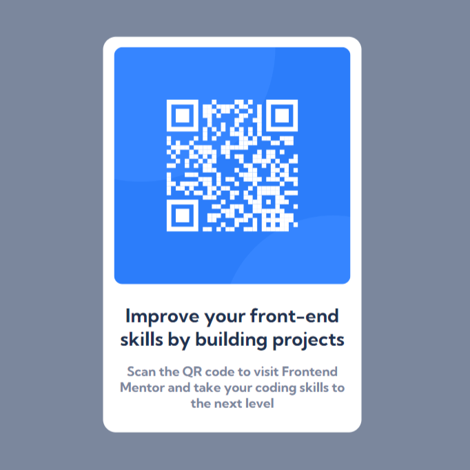

# Frontend Mentor - QR code component solution

This is a solution to the [QR code component challenge on Frontend Mentor](https://www.frontendmentor.io/challenges/qr-code-component-iux_sIO_H). Frontend Mentor challenges help you improve your coding skills by building realistic projects.

## Table of contents

- [Overview](#overview)
- [Screenshot](#screenshot)
- [Links](#links)
- [Built with](#built-with)
- [Author](#author)

## Overview

My first app using React.js! I purposefully choose a simple (maybe the simplest) project on Frontend Mentor in order to focus on acclimatizing myself to the React world. The vast majority of my effort was spent studying React docs to ensure I understood, as best I could, what was happening in the flow of the code. Once I felt I grasped the basics, I set up the development environment (prettier & eslint). Finally, I broke the app down into subcomponents, each styled with unique css. The app build itself was extremely easy, allowing me to get comfortable with creating the jsx and css for each subcomponent with ease.

### Screenshot

### Links

- Live Site URL: [Add live site URL here](https://nablanco.github.io/QR-code-component/)

### Built with

- CSS/Flexbox
- Mobile-first workflow
- [React](https://reactjs.org/) - JS library

## Author

- Website - [Add your name here](https://www.your-site.com)
- Frontend Mentor - [@yourusername](https://www.frontendmentor.io/profile/yourusername)
